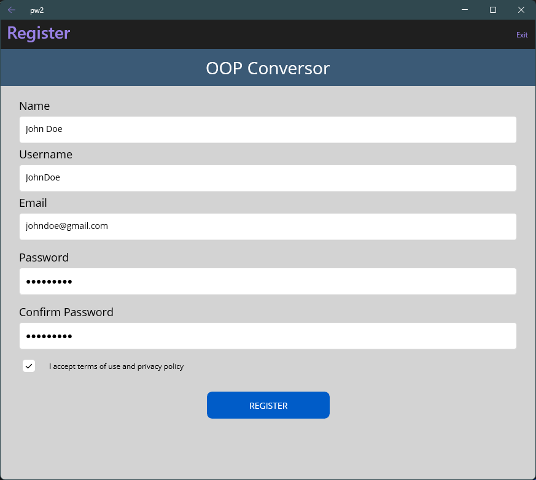

**UNIVERSIDAD FRANCISCO DE VITORIA**

**ESCUELA POLITÉCNICA SUPERIOR**

**Practical Work II - OOP**

María Acevedo Bueno

## 

**Table of contents**

1. [Introduction](#introduction)
2. [Description](#description)
   - [Class Diagram](#class-diagram)
   - [Main Components](#main-components)
   - [App's Pages](#apps-pages)
   - [Key Classes and Responsibilities](#key-classes-and-responsibilities)
   - [Design and Development Decisions](#design-and-development-decisions)
3. [Problems](#problems)
4. [Conclusions](#conclusions)

---

## Introduction

This document presents a comprehensive design overview of the UFV Conversor application, developed as part of Practical Work II for the Object-Oriented Programming (OOP) course. The primary aim of this report is to provide an in-depth analysis of the application's architecture, focusing on its structural and behavioural components.

The report includes a detailed UML class diagram that visually represents the application's internal structure, along with thorough descriptions of its main components and classes. Each class is analysed in terms of its purpose and functionality inside the system.

Additionally, this document outlines several key design decisions made during the development process, explaining the rationale behind them and how they contributed to the overall functionality and maintainability of the application. It also addresses a number of challenges and technical issues encountered during implementation, as well as the strategies employed to overcome them.

Finally, the report concludes with a brief reflection on the development experience, summarising the main lessons learned and offering potential directions for future improvements or extensions of the application.

---

## Description

#### Main Components

The application architecture is organised into three distinct layers, each with a specific responsibility:

- **UI Layer:**  
  This layer is responsible for all user interactions and is implemented using XAML pages (`LoginPage.xaml`, `RegisterPage.xaml`, `PasswordRecoveryPage.xaml`, `ConversorPage.xaml`, and `UserInfoPage.xaml`). Each page is paired with a code-behind file (`*.xaml.cs`) that handles UI logic, event binding, and navigation. The UI is designed to be intuitive and responsive, leveraging MAUI's cross-platform capabilities to ensure consistency across devices. The use of XAML allows for a clear separation between the visual layout and the underlying logic, making the application easier to maintain and extend.

- **Logic Layer:**  
  The core functionality of the application resides in this layer. It includes all business logic, such as number system conversions, input validation, and user operation tracking. The logic is encapsulated in classes (located in the `Guided_Practice` directory and code-behind files) that follow object-oriented principles, promoting reusability and extensibility. The use of abstract base classes and interfaces allows for easy addition of new conversion types or validators. This layer is responsible for ensuring that all operations are performed correctly and efficiently, and that the application remains robust in the face of invalid input or unexpected user actions.

- **Persistence Layer:**  
  Data persistence is managed through CSV files, primarily `users.csv`, which stores user credentials and operation counts, and `operations.csv`, which logs each conversion performed by users. File I/O operations are abstracted to ensure platform independence and to facilitate future migration to more robust storage solutions if needed. The persistence layer is designed to be efficient and reliable, ensuring that user data is always available and up-to-date.

### App's Pages

* **LoginPage**\
  \
  Handles user authentication by validating credentials against the persisted user data. Implements error handling for incorrect logins and provides navigation to registration and password recovery. The login process is designed to be secure and user-friendly, with clear feedback provided for common errors such as incorrect passwords or missing fields.
  
* **RegisterPage**\
  \
  Facilitates new user registration, including input validation for username, email, and password. Ensures uniqueness of usernames and secure password storage. The registration process includes comprehensive validation to prevent common mistakes and ensure that all user data is valid and secure.

* **PasswordRecoveryPage**\
  \
  Allows users to reset their password by verifying their identity (e.g., via email or security questions) and updating the CSV file accordingly. Implements secure password update mechanisms, including validation of password strength and confirmation of new passwords.

* **ConversorPage**\
  \
  The main functional page where users can perform number system conversions. Integrates input validation, conversion logic, and operation tracking. Provides real-time feedback and error messages. The page includes a calculator-like interface for entering numbers and selecting conversion operations, as well as options for specifying bit size where relevant.

* **UserInfoPage**\
  \
  Displays the current user's profile information, including name, username, email, password (masked), and the number of conversions performed. Supports data refresh and logout functionality. The page also displays a history of all conversions performed by the user, allowing them to review their activity and track their progress.

### Class Diagram

- **Inheritance:**  
  Abstract base classes such as `Conversion` and `InputValidator` define common interfaces and shared logic, while concrete subclasses implement specific behaviours for each conversion or validation type.

- **Composition:**  
  The `ConversorPage` composes instances of conversion and validator classes, delegating responsibilities as appropriate.

- **Data Flow:**  
  User actions in the UI layer trigger logic in the business layer, which may read from or write to the persistence layer as needed.

### Key Classes and Responsibilities

- **ConversorPage:**  
  Handles UI events and user input, interacts with the conversion logic, and tracks the number of user operations. Acts as the controller in the MVVM pattern, binding UI elements to logic. Responsible for updating the UI in response to user actions and ensuring that all conversions are performed correctly.

- **Converter:**  
  Manages the available conversion operations and delegates tasks to the appropriate conversion classes. Implements a factory or strategy pattern to select the correct conversion algorithm at runtime. This class is central to the application's extensibility, allowing new conversion types to be added with minimal changes to existing code.

- **Conversion (abstract):**  
  Serves as the base class for all conversions. Defines shared attributes and methods such as `Change` (performs the conversion) and `Validate` (ensures input correctness). Enforces a contract for all derived conversion classes, ensuring consistency and reliability across all conversion operations.

- **[Specific Conversion Classes]:**  
  Includes `DecimalToBinary`, `DecimalToOctal`, `DecimalToHexadecimal`, `DecimalToTwosComplement`, `BinaryToDecimal`, `TwosComplementToDecimal`, `OctalToDecimal`, and `HexadecimalToDecimal`. Each class overrides the `Change` method to implement the logic for converting between specific number systems, handling edge cases such as negative numbers and overflow. These classes encapsulate the core algorithms used by the application, ensuring that all conversions are accurate and efficient.

- **InputValidator (abstract):**  
  Provides the base structure for validating user input across various number formats. Defines a `ValidateInput` method to be implemented by subclasses. Ensures that all input is checked for correctness before any conversion is attempted.

- **[Specific Validator Classes]:**  
  Includes `DecimalInputValidator`, `BinaryInputValidator`, `OctalInputValidator`, and `HexadecimalInputValidator`. Each class implements format-specific validation logic, ensuring correctness before processing the inputs. Validators check for invalid characters, range violations, and format errors, providing detailed feedback to the user in case of invalid input.

- **PasswordRecoveryPage:**  
  This page is in charge of changing a user's password if they have forgotten it. It directly handles the CSV file, ensuring atomic updates and secure password handling. The page includes comprehensive validation to ensure that new passwords are strong and that users cannot reuse old passwords.

- **UserInfo:**  
  This page displays the current user's information (i.e., Name, Username, Email, Password, and Number of Operations performed). It retrieves data from the persistence layer and presents it in a user-friendly format. The page also includes a ListView control for displaying the user's operation history, allowing for efficient browsing and review of past activity.

### Design and Development Decisions

- **Separation of Concerns:**  
  The application cleanly separates the UI, logic, and data persistence layers, improving maintainability.
- **Extensibility:**  
  New conversions can easily be integrated by extending the `Conversion` class and implementing the necessary logic.
- **Validation:**  
  Each conversion uses a dedicated `InputValidator` to ensure correctness, encapsulated within the conversion class to maintain cohesion.
- **Default Bit Size:**  
  On the `ConversorPage`, certain conversion operations (specifically `DecimalToBinary` and `DecimalToTwosComplement`) require the user to specify the bit size for the output representation. To streamline the user experience and ensure consistent results, the application sets a default bit size of 8 bits in the corresponding input field. This default is only relevant for these two conversions; for all other operations, the bit size entry is ignored by the program. The implementation ensures that the bit size parameter is only passed to the conversion logic when necessary, preventing unintended behaviour in conversions that do not require it. This approach both simplifies the UI and reduces the risk of user error.
- **User Tracking:**  
  Each user's data and number of operations is tracked and stored persistently in a CSV file. Said CSV file is stored inside a `files` folder using the `FileSystem.AppDataDirectory` function, as recommended by my professor.
- **Operation Tracking:**  
  When a user starts a session, all the conversions performed in said session are registered in a CSV file, so as to be able to display all the operations executed by the user in the UserInfo page. Said CSV file is stored inside a `files` folder using the `FileSystem.AppDataDirectory` function, as recommended by my professor.
- **ListView Operations Display:**  
  The `UserInfoPage` presents all of a user's operations using a ListView control, enabling efficient vertical scrolling through the operation history while simultaneously displaying other personal information. This design enhances usability by allowing users to review their activity without navigating away from their profile data.
- **Error Handling:**  
  All conversion operations are wrapped in `try-catch` blocks, allowing for graceful error messages and improved user experience. In order to prevent any I/O errors, the same thing was done with the methods that required file access. 

---

## Problems

- **File Access:**  
  At first, managing file paths for reading and writing the CSV file across different platforms was complex due to relative path resolution issues. In the end, thanks to the guidance of my professor, I made use of the App Data Directory (`FileSystem.AppDataDirectory` function) to create a `files` folder that will contain thte files used for user data and operation storage, which is local to the machine of the user running the application. This solved an I/O exception that emerged when running the program in another computer. In order to show the structure of the files used by the application, I have left the `files` folder inside the project folder, but said folder is technically obsolete, it is only used for structural guidance.
- **Input Validation:**  
  Ensuring robust handling of various numeric formats and edge cases (e.g. negative binary values, overflow) required detailed logic and testing, and also the need to find which classes and methods were needed in each case. 
- **UI Responsiveness:**  
  Implementing asynchronous behaviour to keep the UI responsive during validation and processing posed difficulties (since it was the first time encountering and using asynchronous methods), especially avoiding UI thread blocking.
- **Classes and methods to use:**  
  Discerning which method was needed in order to correctly perform the conversion proved to be challenging, and finding how to implement the logic for validation took some time, but finally found out which specific parts of the Guided Practice was needed in order to apply that functionality to this project. 
- **MAUI in VSCode:**  
  The countless errors throughout the process made this practice slightly tiring, especially since debugging the project often caused problems: sometimes it would execute and display the program, while other times the program would exit unexpectedly. I initially assumed this was due to buffer issues, but was unsure how to resolve it. Ultimately, I solved these problems by carefully controlling file access and refactoring the navigation logic—specifically, by avoiding navigation inside a loop and instead using a boolean value to manage flow control. As a result, debugging and running the application became much more reliable, and I was able to consistently visualize the app pages without repeated attempts.

---

## Conclusions

The development of the UFV Conversor application has been a highly instructive experience, particularly in the context of implementing the MAUI front-end components. Focusing on the user interface and user experience aspects allowed for an in-depth exploration of modern UI design patterns, asynchronous programming, and cross-platform considerations. The emphasis on the MAUI part of the project meant that particular attention was paid to creating a responsive, intuitive, and engaging interface that effectively communicates with the underlying logic and data persistence layers.

While the conversion and validation classes had been previously implemented during the Guided Practical Works, the primary contribution lay in integrating these components into a cohesive and user-friendly MAUI application. This approach not only facilitated a smoother development process but also provided valuable insights into managing the complexities associated with UI responsiveness, event handling, and multi-platform consistency. The challenges encountered, such as ensuring seamless file access across different environments and optimising asynchronous operations, have significantly contributed to a more nuanced understanding of modern application development.

In summary, the project achieved its objective of delivering a robust and maintainable MAUI-based interface for the UFV Conversor application. The experience has underscored the critical role of thoughtful UI design in the overall success of a software solution and has provided a solid foundation for further enhancements and refinements in future projects, such as more types of conversions and better user feedback management.

---
