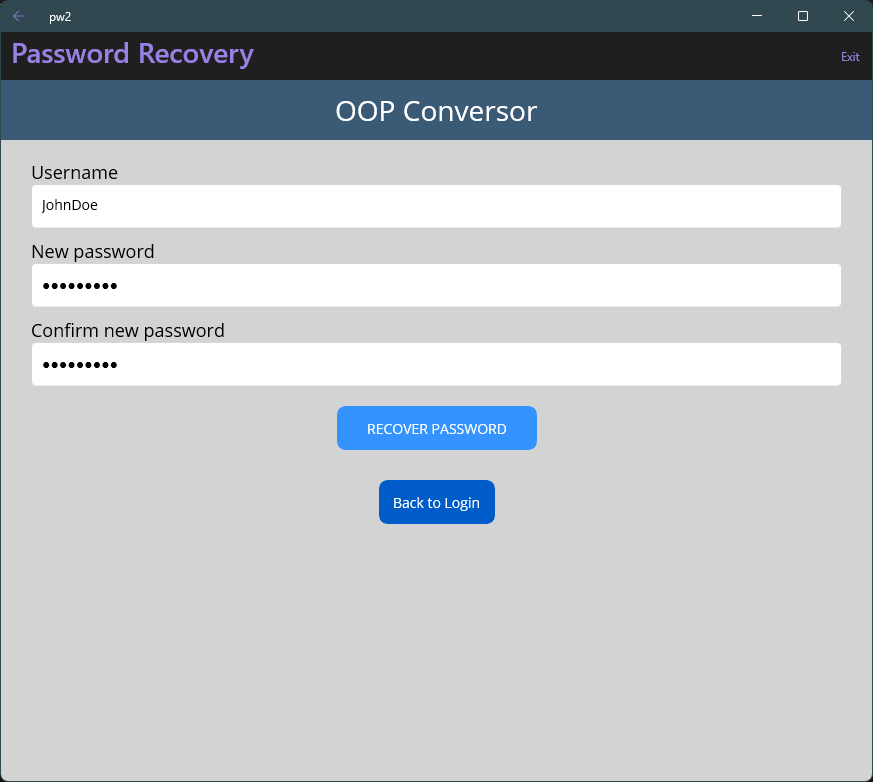
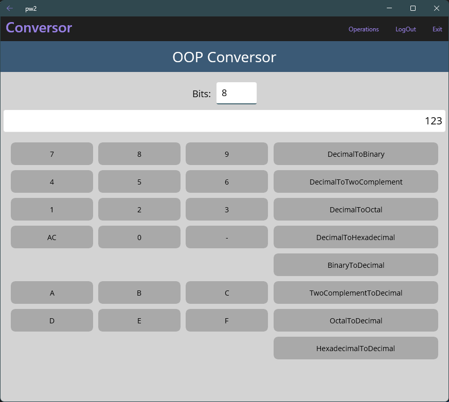
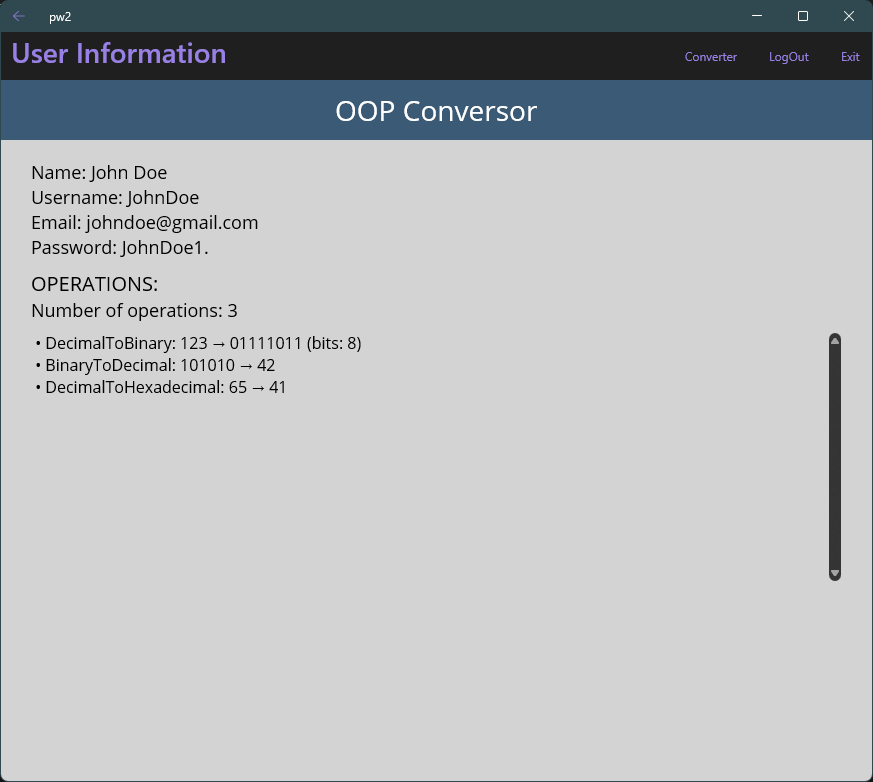
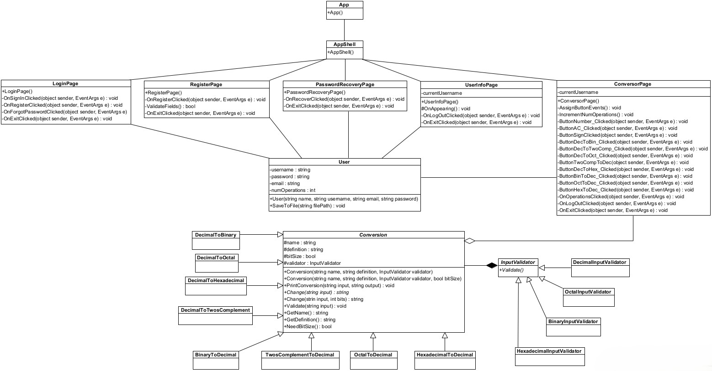

# oop_pw2_ext_2425
This repository is the base structure for Practice 2 of the extraordinary session of Object-Oriented Programming.
**UNIVERSIDAD FRANCISCO DE VITORIA**

**ESCUELA POLITÉCNICA SUPERIOR**

**Practical Work II - OOP**

María Acevedo Bueno

## 

**Table of contents**

1. [Introduction](#introduction)
2. [Description](#description)
   - [Class Diagram](#class-diagram)
   - [Main Components](#main-components)
   - [App's Pages](#apps-pages)
   - [Key Classes and Responsibilities](#key-classes-and-responsibilities)
   - [Design and Development Decisions](#design-and-development-decisions)
3. [Problems](#problems)
4. [Conclusions](#conclusions)

---

## Introduction

This document presents a comprehensive design overview of the UFV Conversor application, developed as part of Practical Work II for the Object-Oriented Programming (OOP) course. The primary aim of this report is to provide an in-depth analysis of the application's architecture, focusing on its structural and behavioural components.

The report includes a detailed UML class diagram that visually represents the application's internal structure, along with thorough descriptions of its main components and classes. Each class is analysed in terms of its purpose and functionality inside the system.

Additionally, this document outlines several key design decisions made during the development process, explaining the rationale behind them and how they contributed to the overall functionality and maintainability of the application. It also addresses a number of challenges and technical issues encountered during implementation, as well as the strategies employed to overcome them.

Finally, the report concludes with a brief reflection on the development experience, summarising the main lessons learned and offering potential directions for future improvements or extensions of the application.

---

## Description

#### Main Components

The application architecture is organised into three distinct layers, each with a specific responsibility:

- **UI Layer:** XAML pages (`LoginPage.xaml`, `RegisterPage.xaml`, `PasswordRecoveryPage.xaml`, `ConversorPage.xaml` and `UserInfoPage.xaml`) responsible for user interaction.
- **Logic Layer:** Implements the core functionality of the application through classes located in the `Guided_Practice` directory, along with code-behind files (`*.xaml.cs`).
- **Persistence Layer:** CSV file (`users.csv`), which holds user credentials and operation counts.

### App's Pages

* **LoginPage**\
  

* **RegisterPage**\
  

* **PasswordRecoveryPage**\
  

* **ConversorPage**\
  

* **UserInfoPage**\
  

### Class Diagram

### Key Classes and Responsibilities

- **ConversorPage:** Handles UI events and user input, interacts with the conversion logic, and tracks the number of user operations.
- **Converter:** Manages the available conversion operations and delegates tasks to the appropriate conversion classes.
- **Conversion (abstract):** Serves as the base class for all conversions. Defines shared attributes and methods such as `Change` or `Validate`.
- **[Specific Conversion Classes]:** Includes `DecimalToBinary`, `DecimalToOctal`, `DecimalToHexadecimal`, `DecimalToTwosComplement`, `BinaryToDecimal`, `TwosComplementToDecimal`, `OctalToDecimal` and `HexadecimalToDecimal`, which implement the logic for converting between specific number systems by overriding the `Change` method.
- **InputValidator (abstract):** Provides the base structure for validating user input across various number formats.
- **[Specific Validator Classes]:** Includes `DecimalInputValidator`, `BinaryInputValidator`, `OctalInputValidator` and `HexadecimalInputValidator`, which implement format-specific validation logic ensuring correctness before processing the inputs.
- **PasswordRecoveryPage:** This page is in charge of changing a user's password if they have forgotten it. It directly handles the CSV file. 
- **UserInfo:** This page displays the current user's information (i.e. Name, Username, Email, Password and Number of Operations performed).

### Design and Development Decisions

- **Separation of Concerns:** The application cleanly separates the UI, logic, and data persistence layers, improving maintainability.
- **Extensibility:** New conversions can easily be integrated by subclassing the `Conversion` class and implementing the necessary logic.
- **Validation:** Each conversion uses a dedicated `InputValidator` to ensure correctness, encapsulated within the conversion class to maintain cohesion.
- **User Tracking:** Each user's data and number of operations is tracked and stored persistently in a CSV file.
- **Error Handling:** All conversion operations are wrapped in `try-catch` blocks, allowing for graceful error messages and improved user experience.

---

## Problems

- **File Access:** Managing file paths for reading and writing the CSV file across different platforms was complex due to relative path resolution issues.
- **Input Validation:** Ensuring robust handling of various numeric formats and edge cases (e.g. negative binary values, overflow) required detailed logic and testing.
- **UI Responsiveness:** Implementing asynchronous behaviour to keep the UI responsive during validation and processing posed difficulties (since it was the first time encountering asynchronous methods), especially avoiding UI thread blocking.
- **Classes and methods to use:** Discerning which class was needed in order to correctly perform the conversion proved to be challenging, and finding how to implement the logic for validation took some time.
- **PasswordRecoveryPage:** I was told later on, that this page was not mandatory, but since I had already implemented it, I left it as is. 
- **MAUI in VSCode:** The countless errors throughout the process made this practice slightly tiring, apart from the fact that debugging the project still causes some problems, as sometimes it executes and shows the program, and others the program exits by itself. I assumed it was because of the buffer, but still didn't know how to dolve that problem. This is why debugging and running the application usually takes various tries before being able to visualize the app pages. 

---

## Conclusions

The development of the UFV Conversor application has been a highly instructive experience, particularly in the context of implementing the MAUI front-end components. Focusing on the user interface and user experience aspects allowed for an in-depth exploration of modern UI design patterns, asynchronous programming, and cross-platform considerations. The emphasis on the MAUI part of the project meant that particular attention was paid to creating a responsive, intuitive, and engaging interface that effectively communicates with the underlying logic and data persistence layers.

While the conversion and validation classes had been previously implemented during the Guided Practical Works, the primary contribution lay in integrating these components into a cohesive and user-friendly MAUI application. This approach not only facilitated a smoother development process but also provided valuable insights into managing the complexities associated with UI responsiveness, event handling, and multi-platform consistency. The challenges encountered, such as ensuring seamless file access across different environments and optimising asynchronous operations, have significantly contributed to a more nuanced understanding of modern application development.

In summary, the project achieved its objective of delivering a robust and maintainable MAUI-based interface for the UFV Conversor application. The experience has underscored the critical role of thoughtful UI design in the overall success of a software solution and has provided a solid foundation for further enhancements and refinements in future projects, such as more types of conversions and better user feedback management.

---
